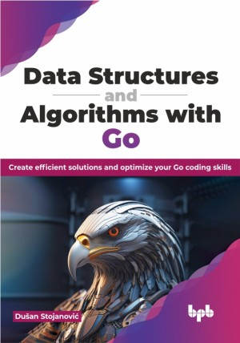

# Data Structures and Algorithms with Go

Dive into the endless possibilities of data structures and algorithms and have fun doing it

This is the repository for [Data Structures and Algorithms with Go
](https://bpbonline.com/products/data-structures-and-algorithms-with-go),published by BPB Publications.

## About the Book
Go, designed by Google, is a modern, open-source language known for its simplicity, readability, and efficiency. It excels at building web applications, network tools, and cloud services. Its clear syntax and built-in concurrency features make it a popular choice for modern developers.

This guide simplifies the basics by introducing arrays, lists, stacks, queues, maps, trees, and graphs in a practical way. Get hands-on experience, understand essential operations, and compare strengths and weaknesses. Perfect your skills with searching, sorting, and efficient data retrieval techniques. Traverse graphs and trees with ease, all illustrated in the Go code for real-world application, and conclude with insights for ongoing learning.

After reading this book, the reader can determine when and why specific data structures should be used and when an algorithm best fits the actual problem’s solution.

## What You Will Learn
• Decide which data structure is the most suitable for a particular problem.

• Implement different algorithms with the Go programming language.

• Recognize which algorithm is best suited for certain scenarios.

• Utilize data structures and algorithm implementations from Go’s standard library.

• Learn how real-life problems can be solved and simulated.

